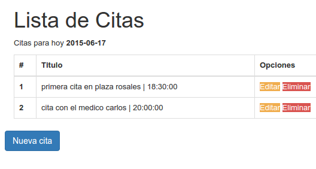

# Registro de citas

## Technologies
- PHP 5.5
- MYSQL 5.6.19

## php extension
 - PHP extension MySQLi

## Configuration database

** Execute SQL **

    CREATE DATABASE IF NOT EXISTS agenda_citas;

    DROP TABLE IF EXISTS `citas`;
    CREATE TABLE `citas` (
      `id` int(11) NOT NULL AUTO_INCREMENT,
      `titulo` varchar(255) DEFAULT NULL,
      `fecha` datetime DEFAULT NULL,
      `date_created` datetime DEFAULT NULL,
      PRIMARY KEY (`id`)
    ) ENGINE=InnoDB DEFAULT CHARSET=utf8;

** File Config ** `edit file : mysqli.php`

    $mysqli = new mysqli("localhost", "root", "123456", "agenda_citas");

## Description
Application web for register date's, reference for the build web  on `docs/images`
- 01 : Register =>  hour min and description (register basic)
- 02 : Edit => edit date of date's
- 03 : Delete => remove record of database.

# image reference app

---

